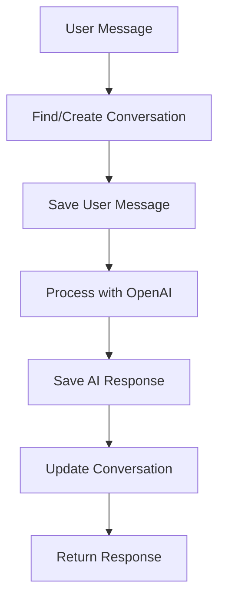

# Conversation and Message Storage Implementation

## Overview

This document describes the implementation of conversation and message storage for the AI Agent Chatbot application. The system now properly stores all chat conversations and messages in the MongoDB database.

## 🏗️ Architecture

### Data Models

#### Conversation Model
```javascript
{
  user_id: ObjectId,           // Reference to User
  agent_id: ObjectId,          // Reference to Agent
  openai_thread_id: String,    // OpenAI thread ID
  status: String,              // 'active', 'closed', 'archived'
  pinned: Boolean,             // Whether conversation is pinned
  createdAt: Date,             // Auto-generated
  updatedAt: Date              // Auto-generated
}
```

#### Message Model
```javascript
{
  conversationId: ObjectId,    // Reference to Conversation
  sender: String,              // 'user', 'agent', 'system'
  senderId: ObjectId,         // Reference to sender (User/Agent)
  senderRef: String,           // 'User', 'Agent', null
  content: String,             // Message text
  attachments: Array,          // File attachments
  tokensUsed: Number,          // OpenAI tokens used
  status: String,              // 'sent', 'delivered', 'read'
  createdAt: Date,             // Auto-generated
  updatedAt: Date              // Auto-generated
}
```

## 🔄 Message Flow

### WebSocket Message Processing

1. **Client sends message** via WebSocket
2. **SocketManager** receives and validates message
3. **SocketService.processMessage()** handles the flow:
   - Find or create conversation
   - Process with OpenAI
   - Save both user message and AI response
4. **Response sent back** to client

### Database Storage Flow



## 🛠️ Implementation Details

### Socket Service Updates

#### `findOrCreateConversation(userId, agentId)`
- Finds existing active conversation between user and agent
- Creates new conversation if none exists
- Returns conversation object

#### `saveMessages(conversationId, userId, agentId, userMessage, aiResponse)`
- Saves user message to database
- Saves AI response to database
- Updates conversation timestamp
- Returns both message objects

### API Endpoints

#### GET `/chats` - List Conversations
Returns all conversations for authenticated user.

#### GET `/chats/:id` - Get Conversation
Returns specific conversation with messages.

#### GET `/chats/:conversationId/history` - Get Conversation History
Returns paginated message history for a conversation.

#### POST `/chats` - Create Conversation
Creates a new conversation.

#### POST `/chats/:id/message` - Send Message
Sends a message to a conversation.

#### POST `/chats/:id/pin` - Pin/Unpin Conversation
Toggles conversation pin status.

#### DELETE `/chats/:id` - Delete Conversation
Deletes conversation and all associated messages.

## 📊 Database Operations

### Conversation Management

```javascript
// Create conversation
const conversation = await Conversation.create({
  user_id: userId,
  agent_id: agentId,
  status: 'active'
});

// Find existing conversation
const conversation = await Conversation.findOne({
  user_id: userId,
  agent_id: agentId,
  status: 'active'
});

// Update conversation
await Conversation.findByIdAndUpdate(conversationId, {
  openai_thread_id: threadId,
  updatedAt: new Date()
});
```

### Message Management

```javascript
// Save user message
const userMessage = await Message.create({
  conversationId: conversationId,
  sender: 'user',
  senderId: userId,
  senderRef: 'User',
  content: userMessage,
  status: 'delivered'
});

// Save AI response
const aiMessage = await Message.create({
  conversationId: conversationId,
  sender: 'agent',
  senderId: agentId,
  senderRef: 'Agent',
  content: aiResponse,
  status: 'sent'
});
```

## 🔍 Query Examples

### Get User's Conversations
```javascript
const conversations = await Conversation.find({ user_id: userId })
  .sort({ updatedAt: -1 })
  .populate('agent_id', 'title description')
  .exec();
```

### Get Conversation Messages
```javascript
const messages = await Message.find({ conversationId })
  .sort({ createdAt: 1 })
  .limit(50)
  .skip((page - 1) * 50)
  .exec();
```

### Get Message Count
```javascript
const messageCount = await Message.countDocuments({ conversationId });
```

## 🧪 Testing

### Test Script
Run the test script to verify storage functionality:

```bash
node test-conversation-storage.js
```

The test script verifies:
- Conversation creation
- Message storage (user and AI)
- Data retrieval
- Pagination
- Status updates
- Cleanup

### Manual Testing

1. **Start the server**:
   ```bash
   npm run dev
   ```

2. **Connect via WebSocket** and send a message:
   ```javascript
   const socket = io('http://localhost:3000');
   socket.emit('register', 'connection123');
   socket.emit('message', {
     userId: 'user123',
     agentId: 'agent456',
     message: 'Hello, how are you?'
   });
   ```

3. **Check database** for stored conversation and messages.

## 🚀 Performance Considerations

### Indexing
- Messages are indexed by `conversationId` and `createdAt` for fast queries
- Conversations are indexed by `user_id` and `agent_id`

### Pagination
- Messages are paginated to handle large conversation histories
- Default limit of 50 messages per page
- Efficient skip/limit queries

### Memory Management
- Lean queries for better performance
- Proper error handling and cleanup
- Connection pooling for database operations

## 🔧 Configuration

### Environment Variables
```bash
MONGO_URI=mongodb://localhost:27017/ai_agent_chatbot
OPENAI_API_KEY=your_openai_key
OPENAI_ASSISTANT_ID=your_assistant_id
```

### Database Connection
The application uses Mongoose with connection pooling:
```javascript
await mongoose.connect(config.mongo.uri, {
  maxPoolSize: config.mongo.maxPoolSize
});
```

## 📈 Monitoring

### Logging
- All database operations are logged
- Error handling with detailed error messages
- Performance metrics for query execution

### Health Checks
- Database connection status
- Message storage success rates
- Conversation creation metrics

## 🔒 Security

### Data Validation
- Input validation for all message data
- User authentication for all endpoints
- Conversation ownership verification

### Data Privacy
- Messages are only accessible by the conversation owner
- Proper data sanitization
- Secure database queries

## 🎯 Future Enhancements

### Planned Features
- Message search functionality
- Conversation archiving
- Message encryption
- Real-time message status updates
- Message reactions and threading
- File attachment support
- Message export functionality

### Scalability
- Database sharding for large datasets
- Redis caching for frequent queries
- Message queuing for high-volume scenarios
- Horizontal scaling support

## 📝 API Documentation

### WebSocket Events

#### `register`
Register a client connection.
```javascript
socket.emit('register', connectionId);
```

#### `message`
Send a message to the AI agent.
```javascript
socket.emit('message', {
  userId: 'user123',
  agentId: 'agent456',
  message: 'Hello!'
});
```

#### `messageResponse`
Receive AI response.
```javascript
socket.on('messageResponse', (response) => {
  console.log('AI Response:', response.message);
});
```

### REST API Endpoints

All endpoints require authentication via JWT token in the `Authorization` header.

#### Authentication
```http
Authorization: Bearer <jwt_token>
```

#### Response Format
```json
{
  "success": true,
  "data": { ... },
  "pagination": { ... }  // For paginated responses
}
```

## 🐛 Troubleshooting

### Common Issues

1. **Messages not saving**: Check database connection and model imports
2. **Conversation not found**: Verify user_id and agent_id references
3. **WebSocket errors**: Check socket service implementation
4. **Performance issues**: Review indexing and query optimization

### Debug Mode
Enable debug logging by setting:
```bash
DEBUG=chatbot:*
```

## 📞 Support

For issues or questions regarding the conversation storage implementation, please refer to the main application documentation or contact the development team.
